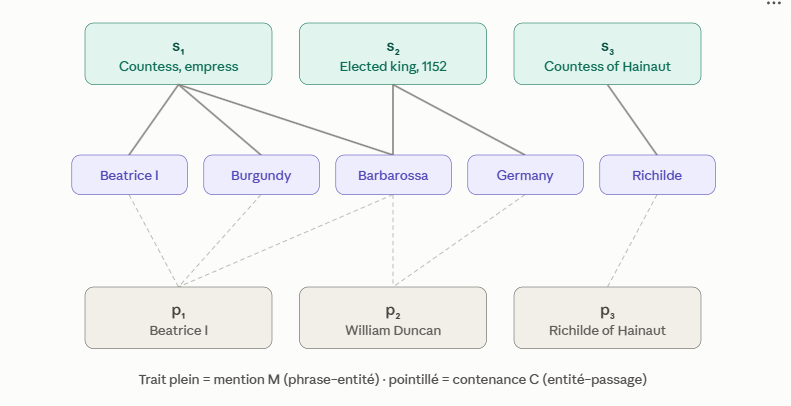

# Thesis idea: scalable graph RAG

## Title

Working title:

> **Scalable Graph RAG: LLM-free graph construction for efficient retrieval**


## Context

The standard RAG pipeline is a flat one. Documents are split into chunks and then each chunk is turned into a dense embedding
vector for semantic similarity or a sparse lexical one for term matching (BM25, or a learned
variant such as SPLADE). When the user asks a question to the LLM, the top-k chunks are scored against it, and those chunks are pasted into the
LLM's context as the evidence it must answer from. Generally, both semantic and lexical search are used to retrieve the chunks which
is known as hybrid retrieval.

Its assumption is that the answer lives in a chunk that *looks like the question*. That
holds for lookup questions and breaks as soon as the evidence is spread over several
chunks: no individual chunk resembles the question closely enough to be retrieved, so the
right passages never reach the LLM and each chunk is scored in isolation, with no notion
that two of them talk about the same entity.

Graph RAG retrieval tries to address this problem. Instead of indexing chunks as independent
points, it builds a structure over the corpus entities, relations and summaries that
records how passages connect, and retrieves by traversing that graph structure.

 

## Problem statement

Graph RAG is proposed as a fix for multi-hop and knowledge-intensive retrieval, but its
standard construction cost puts it out of reach at corpus scale, and its benefit over a
well-tuned hybrid baseline is rarely measured under equal conditions. This thesis asks
whether the construction cost can be removed without removing the benefit, and whether,
once it is removed, a benefit is still there at all.

Several kinds of graph RAG have been presented in the literature : **GraphRAG** (Microsoft) , **RAPTOR**, **HippoRAG**,**E²GraphRAG**.  They differ in *what
structure* they build over the corpus. However every of theses implementations relies on an LLM to extract the entities
and build the graph, which makes creating the graph expensive. A previous attempt to build a graph rag using 
the GraphRag library from microsoft was taking 20h to index with less accurate results than using hybrid retrieval.
Also note that retrieval time is also bigger since (find why when searching the paper here)

After research whether is it possible to build a graph rag without using an llm to construct the graph, 
the following paper has been found : https://arxiv.org/abs/2510.10114]**LinearRAG. It proposes a graph using **NER only** using Spacy, no LLM
extraction and no relation labels, then get the multi-hop behaviour back at query time
through activation and propagation over that graph.

### Main idea of how LinearRAG works

**The Tri-Graph.** Three levels of nodes (passages, sentences, entities) and only two
kinds of edges, both of them membership links: *sentence contains entity* and *passage
contains entity*. They are stored as two binary sparse matrices, `M` (sentences × entities)
and `C` (passages × entities), which are simply the adjacency matrices of that bipartite
graph. Crucially there is **no entity–entity edge** : The graph records *where* entities appear, never *how* they relate.




**Retrieval, stage 1: activation by semantic bridging** :

NER extracts the entities
contained in the query, and each of them is matched to its single closest graph entity by
embedding similarity. Their activation in the graph is the sparse vector `a⁰`: one
non-zero entry per query entity in the question `q`.

The second ingredient is the query-sentence relevance distribution `σ_q`. This vector represents the cosine similarity
between each sentence `s` in the sentence set `S` from the graph and the query `q`.

Activation is then propagated iteratively t times:

```
aᵗ = MAX( Mᵀ(σ_q ⊙ (M aᵗ⁻¹)), aᵗ⁻¹ )
```

aᵗ represents the activation vector of the entities in the t-th iteration of semantic propagation. allowing to 
identify a set of contextually relevant entities that anchors a subgraph in the corpus
that aligns with the reasoning structure of the query

**Retrieval, stage 2: global importance aggregation.** Stage 1 ends with `a_q`, the
activated entities and their scores. Stage 2 turns that into a ranking of passages, and it
changes graph to do so: propagation ran on the sentence-entity graph `M`, ranking runs on
the passage-entity graph `C`, a bipartite graph whose nodes are the passages `V_p` and the
entities `V_e`, with an edge wherever a passage contains an entity.

Every node of that graph is given a starting importance `I`. Entity nodes take `a_q`
directly, so an entity weighs what the propagation gave it. Passage nodes are set by:

```
I(v) = ( λ · sim(q, v) + ln( 1 + Σ_{eᵢ ∈ E_a} a_q⁽ⁱ⁾ · ln(1 + N_eᵢ) / L_eᵢ ) ) · W_p
```

The first term is the passage's own dense similarity to the query. The second sums, over
the activated entities `E_a` the passage contains, their activation score `a_q⁽ⁱ⁾` weighted
by how often the entity occurs in the passage (`N_eᵢ`). A passage
concentrating a few strongly activated entities therefore starts higher than one mentioning
many weak ones. `λ` and `W_p` are constants.

A personalized PageRank is then run over the bipartite graph with those values, and the
passages are ranked by their converged score. The top-k among `V_p` are the retrieved
passages, and they go into the LLM prompt.


Multi-hop reasoning therefore happens over *sentences*, not over relation edges. The path
`Beatrice I → s₁ → Barbarossa → s₂ → Germany` is structurally a graph path; its edges just
happen to be whole sentences whose meaning was never compressed into a predicate.


## Research questions

### RQ1. Can graph RAG be made scalable without giving up its effectiveness?

Sub-questions:

- What does graph construction actually cost, decomposed into entity extraction, entity
  embedding and graph assembly, and how does each part scale with corpus size?
- What are the trade-offs of the cheap pipeline against the expensive one ? (What can a LLM constructed graph materializes that NER does not ?, no hallucinations due to llm extraction, deterministic,...)

### RQ2. In which scenarios does graph retrieval pay off, and as which component?

Not *is the graph better*, which invites a single aggregate number and a yes/no the
literature already answers badly. The useful question is **conditional**: under which
query, corpus and pipeline conditions does the graph signal add something no flat scorer
provides, and, when it does, whether it is better used *instead of* or *on top of* an
existing component?


- Where does the graph win, and on which metric: recall@k, hit@1, all-golds@k, answer
  accuracy? (Standing observation from the current runs: the graph *finds* good passages
  but *orders* them badly, which points at fusion rather than replacement.)
- Are graph and lexical signals complementary in a way dense and lexical are not, measured
  as rank correlation and overlap of retrieved sets, not only as end-metric deltas?


### RQ3. Do the answers to RQ1 and RQ2 transfer to the medical domain, and what has to change for them to?

The transfer question, and a corollary of the first two rather than a separate axis. Its
first half reruns the RQ2 comparison on medical corpora, which is where the graph's
assumptions should pay off, since medical entities are dense, named and standardized and
medical questions are relational.

Its second half is what keeps it from being a rerun: the domain does not only swap the
data, it swaps components of the pipeline. The extractor has to change, a failure mode
appears that does not exist in the general domain (a passage linked to an entity it
*denies*), and a lever appears that is not available there either (normalizing entities
into a medical vocabulary). Without that half the first one is not even measurable, since
a poor medical result would be indistinguishable from an unsuited extractor.

There are spaCy models capable of processing biomedical/clinical text:
https://allenai.github.io/scispacy/

Sub-questions:

- Do biomedical entity extractors change the picture qualitatively rather than
  quantitatively? (Already visible: with a general-domain model the graph finds no seed
  entity on most medical queries and silently degrades to hybrid.)
- Does clinical context handling (negation, uncertainty, hypotheticals, family history)
  change retrieval? Linking a passage to an entity it *denies* is a graph-specific error
  mode that flat retrieval does not have.
- Do medical questions with a genuine relational shape (differential diagnosis, drug
  interaction, symptom→disease) separate graph from hybrid where general-domain questions
  do not?
- Does grounding entities in a medical vocabulary (UMLS/ICD-11 style normalization) buy
  anything over raw extracted strings?

## Plan 

- Implement the graph rag
- Measure its retrieval quality (recall@k,hit@1,MRR,...)
- Answer quality (LLM as a judge)
- Measure retrieval and answer quality in a medical context and identify


Note that if time allows, there is a recent improvement of LinearRAG: **EHRAG** (arXiv
`2604.17458`, https://github.com/yfsong00/EHRAG), which stays LLM-free and linear. It is build on top of LinearRag 
and adds a fourth node type on top: concept nodes obtained by clustering the entity embeddings, each linked to the entities closest to its centroid.
They let the activation jump between entities that are related but never co-occur in a
sentence, which is the blind spot of a purely structural graph. It reports outperforming
LinearRAG
